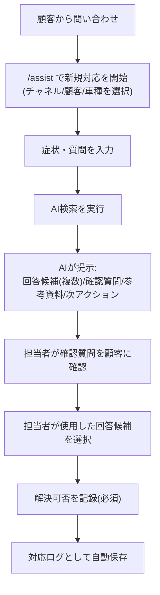
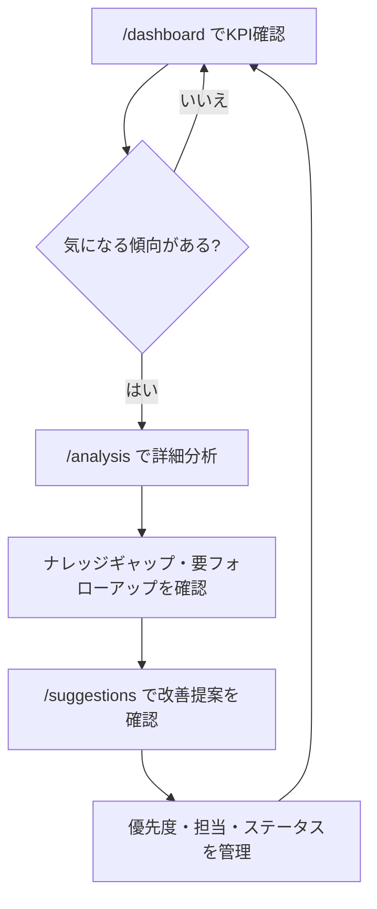
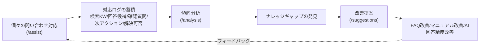

# 02. ユーザーフロー

## 1. コールセンター担当者の業務フロー

### 全体の流れ
1. 顧客から問い合わせが入る（音声通話 または テキストチャネル）
2. 担当者が `/assist` 画面で新規対応を開始する（チャネル・顧客/代理店・車種等の基本情報を選択）
3. 担当者が顧客の症状・質問を自由記述で入力する
4. 「AI検索」を実行する
5. AIが以下の4要素を提示する
   - 回答候補（複数）
   - 確認質問（担当者が顧客に確認すべき事項）
   - 参考資料（FAQ/マニュアル等）
   - 次アクション（推奨される次の行動）
6. 担当者は提示された確認質問を顧客に投げかけ、回答を得る
7. 担当者は回答候補の中から実際に使用したものを選択する（複数使う場合や、候補以外の対応をした場合も選べるようにする）
8. 担当者は対応終了時に、解決可否（解決済み／エスカレ／保留中）を**必須で記録する**
9. 対応内容がログとして自動保存される

### エスカレーションが発生する場合
- 回答候補・参考資料で解決できないと担当者が判断した場合、解決可否を「エスカレ」として記録し、次アクションに従って上位担当・専門部署に引き継ぐ
- エスカレした案件も含めてログは保存され、`/analysis` の「要フォローアップ一覧」に反映される

## 2. 管理者の確認フロー

1. 管理者が `/dashboard` にアクセスし、全体KPI（対応件数、解決率、AI活用率、チャネル別内訳等）を確認する
2. 気になる傾向（解決率の低下、特定カテゴリの件数急増等）があれば `/analysis` に遷移する
3. `/analysis` でカテゴリ別パフォーマンス、ナレッジギャップ（AIが答えられなかった質問）、要フォローアップ一覧を確認する
4. 特に優先度の高いナレッジギャップについて `/suggestions` に遷移する
5. `/suggestions` でAIが提案する改善アクション（FAQ拡充、マニュアル改善、トレーニング等）を確認し、優先度・担当・ステータスを管理する
6. 改善アクションの実施状況（未対応/対応中/完了）を継続的に追跡する

## 3. 問い合わせ対応からログ蓄積・改善サイクルまでの流れ

このPoCが伝えたい最も重要な流れは、**個々の対応が自動的に組織のナレッジ改善につながる**という循環構造である。

### 各ステップで蓄積されるログ
| フロー上の位置 | 蓄積されるログ |
|---|---|
| 症状・質問の入力 | 問い合わせ内容（原文） |
| AI検索 | 検索キーワード |
| AI提示 | 回答候補一覧、確認質問、参考資料、次アクション |
| 担当者の対応 | 採用した回答候補、確認質問への回答 |
| 対応終了 | 解決可否（必須） |

このログが `/analysis` の集計対象となり、未解決テーマや頻出パターンが可視化され、`/suggestions` の改善提案の元データとなる。
