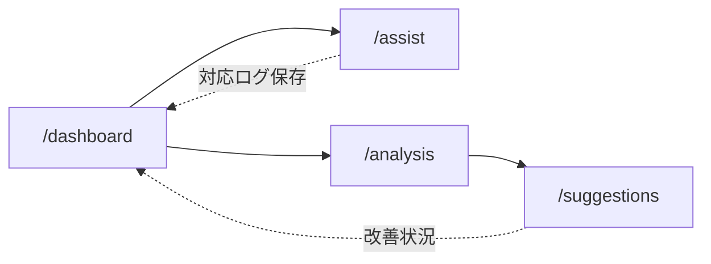

# 03. 画面設計

## 1. 必要な画面一覧（Phase 1: 4画面）

| # | 画面名 | URL | 主対象ユーザー |
|---|--------|-----|------|
| 1 | ダッシュボード | `/dashboard` | 管理者（担当者も閲覧可） |
| 2 | 対応支援（旧: コール対応LIVE） | `/assist` | コールセンター担当者 |
| 3 | 質問分析 | `/analysis` | 管理者 |
| 4 | AI改善提案 | `/suggestions` | 管理者 |

既存モックにあった `/captions`（動画キャプション）はPhase 1のスコープ外のため作成しない。

## 2. 各画面の目的・表示情報・ユーザー操作

### 2-1. ダッシュボード（`/dashboard`）

**目的**: 管理者が全体状況を素早く把握できるようにする。

**表示する情報**
- 直近期間のKPIサマリー: 総対応件数、解決率、AI活用率（回答候補が採用された割合）、顧客満足度
- チャネル別内訳（音声／テキスト）
- 言語別内訳（英/仏/日）
- カテゴリ別問い合わせ件数
- 解決ステータス内訳（解決済み／エスカレ／保留中）
- 日別対応件数の推移
- 最近の対応履歴一覧（ステータス・カテゴリ・チャネル付き）

**ユーザー操作**
- 期間フィルタ（今日／直近7日／直近30日等）
- カテゴリ・チャネル・言語での絞り込み
- 対応履歴一覧から個別ログの詳細（`/assist`で記録された内容）へ遷移

### 2-2. 対応支援（`/assist`）

**目的**: コールセンター担当者が問い合わせ対応中に、AIの検索・回答支援を受けながら対応し、対応結果を記録できるようにする。**Phase 1で最も伝えたい中核画面。**

**表示する情報・画面構成（6ステップ）**

| ステップ | 表示内容 |
|---|---|
① 受付 | 対応チャネル（音声／テキスト）、顧客・代理店・車種などの基本情報 |
| ② 入力 | 症状・質問の自由記述入力欄 |
| ③ 検索 | AI検索実行ボタン、検索中の状態表示 |
| ④ 提示 | 回答候補（複数、カード形式）／確認質問／参考資料（FAQ・マニュアルへのリンクや抜粋）／次アクション（推奨行動） |
| ⑤ 記録 | 採用した回答候補の選択、解決可否（解決済み／エスカレ／保留中）の選択 |
| ⑥ 完了 | 対応終了ボタン（解決可否が未選択の場合は無効化） |

**ユーザー操作**
- 対応チャネル・基本情報の選択
- 症状・質問のテキスト入力
- 「AI検索」ボタンの押下
- 回答候補の選択（採用したものにチェック、複数選択可）
- 確認質問に対する顧客の回答をメモとして記録
- 次アクションの実施有無をチェック
- 解決可否の選択（**必須。未選択では対応終了できない**）
- 「対応終了」ボタンの押下でログを保存

### 2-3. 質問分析（`/analysis`）

**目的**: 管理者が問い合わせ傾向・未解決テーマ（ナレッジギャップ）を把握できるようにする。

**表示する情報**
- カテゴリ別パフォーマンス表（件数／解決率／エスカレ率／AI活用率／満足度）
- ナレッジギャップ一覧（AIが有効な回答候補を提示できなかった、または担当者が候補を採用しなかった質問。優先度付き）
- カテゴリ別スコアのレーダーチャート
- 車種×カテゴリのヒートマップ
- 要フォローアップ（エスカレ）案件一覧

**ユーザー操作**
- カテゴリ・期間・車種でのフィルタ
- ナレッジギャップ一覧から `/suggestions` の該当提案へ遷移
- 要フォローアップ一覧から個別ログの詳細確認

### 2-4. AI改善提案（`/suggestions`）

**目的**: 分析結果から自動生成された改善アクションを管理者が確認・管理できるようにする。

**表示する情報**
- 改善アクション一覧（FAQ拡充／マニュアル改善／AI回答精度改善／トレーニング等）
- 各アクションの優先度・対象カテゴリ・影響件数（関連する問い合わせ件数）
- ステータス（未対応／対応中／完了）

**ユーザー操作**
- ステータスでのフィルタ
- ステータスの更新（未対応→対応中→完了）
- 「AI再生成」ボタン（最新ログに基づき提案を再生成する体裁のモック操作）

## 3. 画面遷移の全体像

## 4. 将来画面（Phase 1では作成しない）

- 販売店スタッフ向け画面（自店の問い合わせ状況確認等）
- エンドユーザー向け自己解決ポータル
- 動画キャプション生成画面（`/captions`の再導入）
