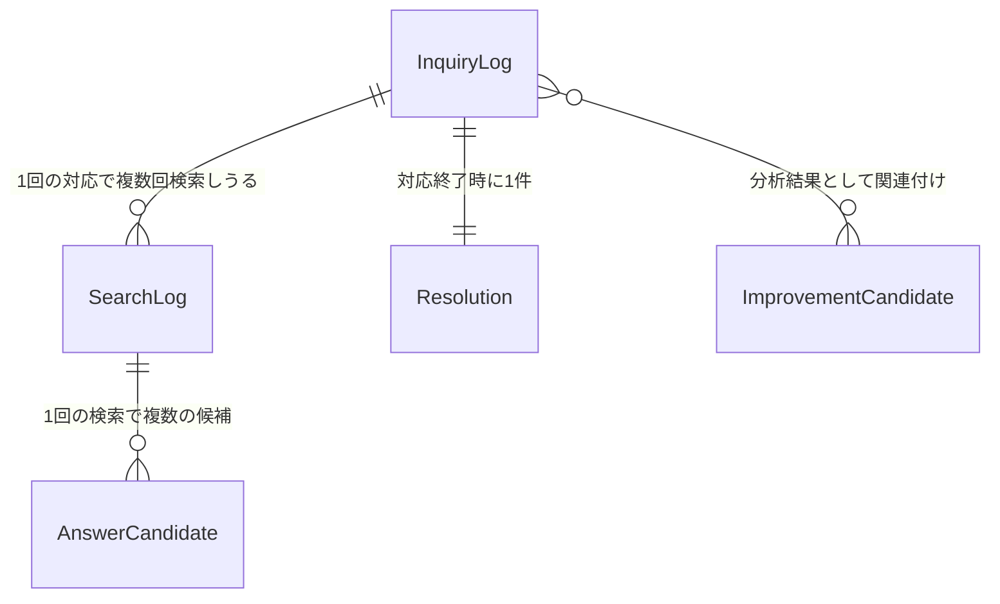

# 04. データモデル

> 本ドキュメントはPhase 1のモック用データモデルの設計方針です。実際のDB設計ではなく、モックデータ（TypeScript型＋ハードコードデータ）としての利用を想定しています。型は例示であり、実装時のフレームワーク・ライブラリに合わせて調整してください。

## 1. 全体構成の考え方

`/assist` での1回の対応が1件の**問い合わせログ（InquiryLog）**として記録され、その中に**検索ログ（SearchLog）**・**回答候補（AnswerCandidate）**・**解決結果（Resolution）**が紐づく。これらの蓄積データを分析し、**FAQ改善候補（ImprovementCandidate）**が生成される、という構造。



## 2. 問い合わせログ（InquiryLog）

`/assist` での1件の対応単位。

```ts
interface InquiryLog {
  id: string;                      // 例: "inq_00001"
  createdAt: string;                // ISO8601
  channel: "voice" | "text";        // 音声 / テキスト（WhatsApp等）
  language: "en" | "fr" | "ja";      // 対応言語
  operatorId: string;                // 対応した担当者ID
  distributorId: string;             // 代理店ID（将来の他商材展開を見据え、店舗ではなく代理店単位で持つ）
  country: string;                   // 対応国（例: "KE", "CI" 等ISO国コード）

  // 対象商材（Phase 1では自動車。将来的に他商材にも対応できるよう分離）
  productCategory: "automotive";      // 将来的に "electronics" 等を追加できるようenum化
  vehicleBrand: string;                // 例: "Toyota"
  vehicleModel: string;                // 例: "Hilux"
  saleType: "new" | "certified_used" | "grey_import"; // 新車/正規中古車/並行輸入車

  // 問い合わせ内容
  inquiryCategory: string;             // 例: "部品供給・納期"
  rawInquiryText: string;              // 担当者が入力した症状・質問の原文

  searchLogs: SearchLog[];             // 1件の対応中に複数回検索されうる
  resolution: Resolution;              // 対応終了時に必須で1件
}
```

## 3. 検索ログ（SearchLog）

担当者が入力した内容をもとにAIが検索を実行した1回分の記録。

```ts
interface SearchLog {
  id: string;                    // 例: "search_00001"
  inquiryLogId: string;           // 紐づくInquiryLogのid
  executedAt: string;
  searchKeyword: string;          // 検索に使われたキーワード（担当者の入力から抽出、または入力そのもの）
  answerCandidates: AnswerCandidate[]; // 提示された回答候補（複数）
  confirmationQuestions: ConfirmationQuestion[]; // 確認質問
  referenceMaterials: ReferenceMaterial[];        // 参考資料
  nextActions: NextAction[];                       // 次アクション
}

interface ConfirmationQuestion {
  id: string;
  questionText: string;            // 例: "保証書の発行日を確認しましたか？"
  operatorAnswer?: string;          // 担当者が記録した顧客の回答（任意入力）
}

interface ReferenceMaterial {
  id: string;
  title: string;                    // 例: "ハイラックス 部品供給ガイド"
  type: "faq" | "manual" | "video";
  url?: string;
}

interface NextAction {
  id: string;
  actionText: string;               // 例: "部品部門へエスカレーション"
  wasTaken: boolean;                  // 担当者が実施したか
}
```

## 4. 回答候補（AnswerCandidate）

AIが提示する回答の候補。**単一回答にせず、必ず複数件（1件のみの場合も配列として保持）**。

```ts
interface AnswerCandidate {
  id: string;
  searchLogId: string;              // 紐づくSearchLogのid
  answerText: string;                // 回答本文
  confidenceLabel: "high" | "medium" | "low"; // モック上の確信度表示（実際のスコアではなくラベル表現）
  sourceMaterialId?: string;          // 参照元resource（ReferenceMaterialのid）
  wasAdopted: boolean;                 // 担当者が実際に採用したか
}
```

## 5. 解決結果（Resolution）

対応終了時に**必須**で記録される。

```ts
interface Resolution {
  id: string;
  inquiryLogId: string;
  status: "resolved" | "escalated" | "pending"; // 解決済み/エスカレ/保留中
  recordedAt: string;
  recordedBy: string;                // 担当者ID
  note?: string;                       // 任意メモ
}
```

> 実装上の注意: `Resolution` は `InquiryLog` に対して1:1必須。対応終了処理（対応完了ボタン押下）は `status` が未設定の場合は実行できない設計とする。

## 6. FAQ改善候補（ImprovementCandidate）

`/suggestions` 画面で表示される、分析結果から導かれる改善アクション。

```ts
interface ImprovementCandidate {
  id: string;
  generatedAt: string;
  type: "faq_update" | "manual_update" | "ai_accuracy" | "training"; // FAQ拡充/マニュアル改善/AI回答精度改善/トレーニング
  title: string;                       // 例: "並行輸入車の保証範囲FAQを追加"
  description: string;
  relatedCategory: string;              // 関連する問い合わせカテゴリ
  relatedInquiryLogIds: string[];        // 根拠となった問い合わせログのid群
  affectedCount: number;                  // 影響件数（関連する問い合わせ件数）
  priority: "high" | "medium" | "low";
  status: "not_started" | "in_progress" | "done";
}
```

## 7. 集計・分析で使う派生データ（`/analysis` `/dashboard` 用）

保存はせず、上記ログから都度集計する想定。

- カテゴリ別パフォーマンス: `inquiryCategory` ごとの件数／解決率／エスカレ率／AI活用率（`AnswerCandidate.wasAdopted`の割合）
- ナレッジギャップ: `AnswerCandidate` がすべて `wasAdopted: false` だった `SearchLog`、または `resolution.status === "escalated"` の案件
- チャネル別・言語別内訳: `InquiryLog.channel` / `InquiryLog.language` の集計
- 車種×カテゴリのヒートマップ: `vehicleModel` × `inquiryCategory` の件数集計

## 8. Phase 1のモックデータ作成方針

- `vehicleBrand` / `vehicleModel` の構成比は、トヨタが最多（特にハイラックス）、次いでスズキ・VW・日産等、実際の市場シェア感に近づける
- `saleType` は並行輸入車・中古車の比率を高めに設定する
- `inquiryCategory` は「部品供給・納期」「整備・アフターサービス拠点案内」「悪路走行・耐久性」「燃費・維持費」「並行輸入車・中古車のサポート範囲」「ローン・フリート契約」「保証・リコール」「事故・保険」の8カテゴリを基本とする
